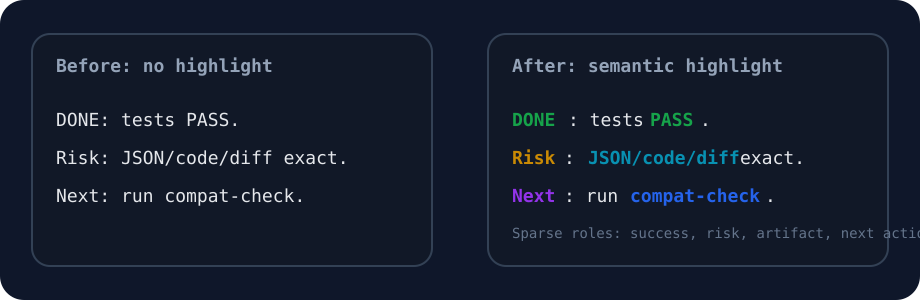

# Codexplain

> Codex explanations suck. Codexplain improves them into clear Claude-like
> explanations with better UX and Gordon Ramsay-level intolerance for terrible
> AI output.

Codexplain is a **local-first explanation UX layer for Codex**. It does not
replace Codex, change the model, or rewrite strict artifacts. It makes Codex
answers easier to scan with TLDRs, width-safe tables, capability diagrams,
semantic highlights, progress blocks, and reversible project-local setup.

```text
Codex writes the answer.
Codexplain makes the explanation readable.
JSON, code, diffs, logs, tests, and patches stay exact.
```

## 🧭 Quick Map

```text
 Go here                  What you get
━━━━━━━━━━━━━━━━━━━━━━━  ━━━━━━━━━━━━━━━━━━━━━━━━━━━━━━━━━━━━━
 🚀 30-second pitch       Why Codexplain exists
───────────────────────  ─────────────────────────────────────
 👀 Before / After        The problems it fixes visually
───────────────────────  ─────────────────────────────────────
 ⚡ Install               Local setup and uninstall
───────────────────────  ─────────────────────────────────────
 📚 Docs                  Detailed guides split by category
───────────────────────  ─────────────────────────────────────
 ✅ Verification          Current quality gate commands
───────────────────────  ─────────────────────────────────────
 📄 License               Attribution + commercial terms
```

## 🚀 30-Second Pitch

```text
 Pain                            Codexplain fix
━━━━━━━━━━━━━━━━━━━━━━━━━━━━━━  ━━━━━━━━━━━━━━━━━━━━━━━━━━━━━━━━━━━
 Dense prose                     TLDR, sections, numbered flow
──────────────────────────────  ───────────────────────────────────
 Broken terminal tables          Width-safe renderer + row dividers
──────────────────────────────  ───────────────────────────────────
 File-by-file architecture dumps Capability maps and flow diagrams
──────────────────────────────  ───────────────────────────────────
 Random rainbow highlighting     Sparse semantic attention cues
──────────────────────────────  ───────────────────────────────────
 Risky install/uninstall         Project-local reversible adapter
```

## ✨ What You Get

1️⃣ **Readable explanations**  
TLDRs, short sections, mandatory architecture diagrams, tables, progress
reports, risk panels, and next actions.

2️⃣ **Strict artifact safety**  
JSON, code, diffs, patches, logs, tests, and commit messages bypass decorative
rendering.

3️⃣ **Semantic color, not rainbow noise**  
Success, warning, danger, command, path, and artifact references get restrained
highlighting. Ordinary nouns stay plain.

4️⃣ **Meaningful emojis**  
🧭 architecture, ✅ success, ⚠️ risk, 🚨 failure, 🔎 evidence, 🛠️ fix, and 🚀
next-step markers make explanations easier to scan.

5️⃣ **Project-local control**  
`on`, `off`, and uninstall remove only Codexplain-managed state.

6️⃣ **Custom explanation styles**  
Teams can add styles such as research-card, problem-diagnosis, checklist,
Notion-style blocks, or their own triggers.

## 👀 Before / After

### 1️⃣ Architecture: File Dump → Capability Map

**Before**

```text
README.md explains the project. rust/codexplain.rs implements the CLI.
package.json exposes commands. .codexplain contains config and shims.
```

**After**

```text
• TLDR
  Codexplain is a presentation boundary around Codex answers.

┌───────────────────────┐
│ Activation Boundary   │
│ session/project/global│
└───────────┬───────────┘
────────────▼────────────
┌───────────┴───────────┐
│ Strict Safety         │
│ JSON/code/diff pass   │
└───────────┬───────────┘
────────────▼────────────
┌───────────┴───────────┐
│ UX Planner            │
│ chooses useful blocks │
└───────────┬───────────┘
────────────▼────────────
┌───────────┴───────────┐
│ Semantic Renderer     │
│ width-safe + colored  │
└───────────────────────┘
```

### 2️⃣ Tables: Overflow → Row-Divided Wrapping

**Before**

```text
│ Policy │ JSON/code/diff/log/test output must remain exact but this long text spills outside the table
│ Render │ Flow/table/progress/risk/color should be selected dynamically
```

**After**

```text
 Area     Description
━━━━━━━━  ━━━━━━━━━━━━━━━━━━━━━━━━━━━━━━━━━━━━━━━━━━━━━━━━━━━━━━━━━━━━━
 Policy   JSON/code/diff/log/test output stays exact before rendering.
────────  ─────────────────────────────────────────────────────────────
 Render   Flow, table, progress, risk, and color are chosen by prompt,
          profile, and safety rules.
────────  ─────────────────────────────────────────────────────────────
 Scope    Local on/off removes only Codexplain-managed state.
```

### 3️⃣ Highlight: Plain Text → Semantic Attention

**Before**

```text
DONE: tests PASS. Risk: JSON/code/diff output must stay exact.
Next: run compat-check before release.
```

**After**



```text
 Meaning       Highlight role   Example terms
━━━━━━━━━━━━  ━━━━━━━━━━━━━━━  ━━━━━━━━━━━━━━━━━━━━━━━━━━━━━━━
 ✅ Success    green + bold     PASS, DONE, APPROVED
────────────  ───────────────  ───────────────────────────────
 ⚠️ Warning    amber + bold     risk, drift, regression
────────────  ───────────────  ───────────────────────────────
 🚨 Danger     red + bold       FAIL, blocked, unsafe, OOM
────────────  ───────────────  ───────────────────────────────
 🔎 Reference  cyan/blue        commands, paths, JSON/code/diff
```

GitHub can sanitize inline CSS, so the SVG preview makes the
highlight/no-highlight difference visible while the examples remain copyable.

## ⚡ Install

### 1️⃣ Install and enable for one project

```bash
npm install -g codexplain
codexplain install-codex --local --force
```

Homebrew users can install from the tap formula:

```bash
brew tap NomaDamas/Codexplain https://github.com/NomaDamas/Codexplain
brew install codexplain
```

### 2️⃣ Use it directly

```bash
codexplain shape \
  --prompt "Explain this architecture with TLDR and a table" \
  --response "DONE: tests PASS. Risk: JSON/code/diff output must stay exact."
```

### 3️⃣ Turn it off cleanly

```bash
codexplain uninstall-codex --local
```

Local mode writes only Codexplain-managed files and blocks. Global Codex
guidance is opt-in:

```bash
codexplain install-codex --global --force
```

## 🎛️ Useful Commands

```text
 Command                              Purpose
━━━━━━━━━━━━━━━━━━━━━━━━━━━━━━━━━━━  ━━━━━━━━━━━━━━━━━━━━━━━━━━━━━━━
 codexplain                           Open the terminal settings UI
───────────────────────────────────  ───────────────────────────────
 codexplain settings-ui               Explicit settings UI command
───────────────────────────────────  ───────────────────────────────
 codexplain color rules               Show semantic color rules
───────────────────────────────────  ───────────────────────────────
 codexplain style list                List custom explanation styles
───────────────────────────────────  ───────────────────────────────
 codexplain style add ...             Add a team-specific style
───────────────────────────────────  ───────────────────────────────
 codexplain quality-check --width 88  Validate renderer contracts
───────────────────────────────────  ───────────────────────────────
 codexplain compat-check              Validate local compatibility
───────────────────────────────────  ───────────────────────────────
 codexplain tui-adapter status        Inspect Codex TUI adapter state
───────────────────────────────────  ───────────────────────────────
 codexplain harness-adapter status    Inspect harness adapter state
───────────────────────────────────  ───────────────────────────────
 codexplain slash harness off lazycodex
                                      Disable one harness adapter through slash
───────────────────────────────────  ───────────────────────────────
 codexplain harness-adapter envelope  Print integration contract for harnesses
```

## 📚 Docs

- 🏗️ **Architecture**: [docs/architecture.md](docs/architecture.md)
- ✨ **Feature catalog**: [docs/features.md](docs/features.md)
- ⚙️ **Setup and lifecycle**: [docs/setup-and-lifecycle.md](docs/setup-and-lifecycle.md)
- 🎛️ **CLI reference**: [docs/cli-reference.md](docs/cli-reference.md)
- 🎨 **Explanation UX methodology**: [docs/explanation-ux-methodology.md](docs/explanation-ux-methodology.md)
- 📚 **Research basis**: [docs/explanation-research.md](docs/explanation-research.md)
- 🧩 **Codex TUI adapter roadmap**: [docs/codex-tui-adapter-roadmap.md](docs/codex-tui-adapter-roadmap.md)
- 🔌 **Upstream style hook proposal**: [docs/upstream-codex-tui-style-hook.md](docs/upstream-codex-tui-style-hook.md)

## ✅ Verification

```bash
cargo fmt --check
cargo test
./bin/codexplain quality-check --width 88
./bin/codexplain compat-check
```

Current quality contract:

```text
width-safe tables     row dividers required
architecture diagrams renderer-owned boxes
strict artifacts      preserved exactly
color policy          sparse semantic highlights
scope control         reversible project-local default
```

## 📄 License

Codexplain uses a custom source-available license:

```text
Personal, research, education, and internal non-commercial use: allowed.
Public redistribution or public product use: attribution required.
Commercial use without attribution, or substantial paid-product use:
separate commercial agreement / revenue-share terms required.
```

See [LICENSE](LICENSE) for the full terms.

## 🧠 Design Principle

Codexplain should make AI output easier to understand without making it less
safe to copy. If a response is an exact artifact, preserve it. If it is an
explanation, make it readable.
